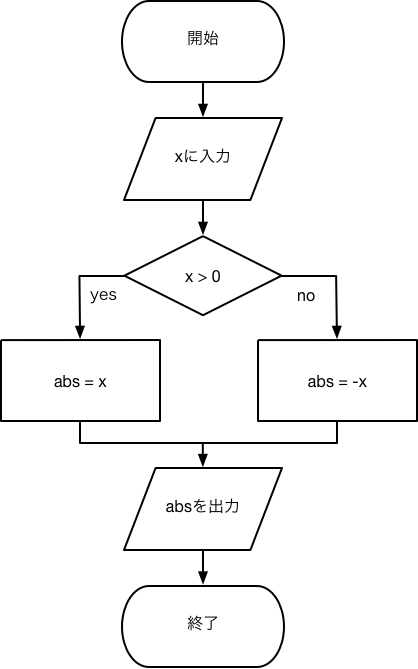

# 情報システム系実験II

### 本実験の目的

本実験を通し，C言語の基礎的なコーディングの仕方とフローチャートを通しプログラミングで必要な論理的な思考を身につけることを目標とする．

### 注意

* 必ず筆記用具，実験書，プログラミング(C言語)の教科書を持ってくること．
* 注意事項は__注__，発展的内容には__発展__と書かれている．
* 発展と書いてある問題は，時間がある場合取り組む．

## 第0回 コーディングに対する全体的な注意

プログラミングは最も重要なのは，読みやすい可読性の高いコードを書くことです．
可読性を高めるために次のようなことを注意してプログラミングしましょう．

* コメントを書く．
* インデントをする．
* マジックナンバーをなくす．
* 変数名，関数名，クラス名などを分かりやすいものにする(命名規則にあわせる)．
* 分かりやすい表現(処理)を使う．
* コードを機能別に関数，クラス，ファイル等に分ける．

## 第1回 四則演算と変数の型

### 目的

プログラミングでは扱うデータに種類がある．それぞれの特徴を知らなければ，正確に動作するプログラムは作れない．本課題では，簡単な四則演算と変数の型について理解を深めることを目的とする．

### 変数の種類

変数とは，プログラム内で数値や文字を保存するための入れ物である．変数にはいくつかの種類がある．C言語で扱う変数は大きく整数型，浮動小数型，文字型の3種類である．整数型の変数には整数を，浮動小数型の変数には自然数を，文字型には文字を格納することができる．プログラミングでは，これらの変数型を用途に応じ適切に使い分ける必要がある．初心者である諸君は，まず，整数型int，浮動小数型double，文字型charの3種類を覚えておこう．C言語で用いることができる変数型の一部を表に示す．int，double，char以外にも型があることを知っておこう．

__発展__ char型は整数型でもある．また，int，longなど環境によって使える桁数が変わる変数型がある．符号なし(正の値)の変数も作ることが可能である．その場合は方の前にunsignedと書く．

| データ型 | データ型の名称  |
|:-------:|:------------:|
|char     | 符号付き8bit整数型|
|short    | 符号付き短整数型|
|int      | 符号付き整数型|
|long int | 符号付き長整数型|
|long long| 符号付き長長整数型|
|float    | 単精度実浮動小数点型|
|double   | 倍精度実浮動小数点型|
|char     | 符号付き文字型|

変数a，b，c，d, eをそれぞれchar型，int型，double型で宣言した例を示す．

```c
/*リスト1.1*/

/*宣言*/
char a;
int b, c;
double d;
double e = 2.7;

/*変数に文字もしくは数を入れる。*/
a = 'X';
b = 10;
c = 100;
d = 1.1;
```

変数の宣言は

```c
データ型 変数名;
```

の形式で行う．同じ型の変数を宣言するときは"int b, c;"のように一行に書くことができる(もちろん一つづつ宣言しても良い)．また，変数を宣言すると同時に初期化したい場合も，"double e = 2.7;"のように一行で書くことができる．

変数に値を代入する場合は

```c
変数名  = 値;
```

というように書く．


__注__ /*コメント*/はコメントと呼ばれ，/* */で囲まれた部分は実行されない．そのため，ソースコードの注意事項やメモ，もしくは一時的に無効にしたいコードを/* */の中身に書く．


__課題1.1__ 次の問に答えよ．

1. 数値の上限が127の整数型変数を作る場合，どの型を用いればよいか答えよ．そしてその理由を答えよ．
2. 文字列を扱う場合，どの型を用いればよいか答えよ．
3. 最も精度が高い(使える桁数が多い)加減乗除を行いたい場合，どの型を用いればよいか答えよ．
4. 最も長い桁を表現できる整数型はどれか答えよ．

### printfの表示

C言語では画面にデータを表示する場合，よくprintfが用いられる．printfの使い方は次のとおりである．

```c
printf("文字列と変換指定子", 変数);
```
printf関数は"(ダブルクォーテーション)でくくられた部分が画面に表示する．そして，変数と書かれた部分に表示したい変数を書くと表示される．ただし，変数に対応した変数指定子をダブルクォーテーション内に書く必要がある．ダブルクォーテーション内に書かれた文字列はそのまま表示される．また，変数の部分は省略することができる．次に使用例を示す．

```c
/*リスト1.2*/
#include <stdio.h>
int main(void)
{
    int i = 16;
    double f = 3.14;
    char c1 = 'A';
    char *c2 = "Hello"

    printf("printfの使い方\n");

    /*変数の表示*/
    printf("整数 %d\n", i);
    printf("浮動小数 %f\n", f);
    printf("文字 %c\n", c1);
    printf("整数 %d\n", c1);
    printf("文字列 %s\n", c2);
    printf("8進数 %s\n", i);
    printf("16進数 %x\n", i);

    /*変数と変数指定子の型が異なった場合*/
    printf("整数 %f\n", i);
    printf("浮動小数 %d\n", f); 
}
```

__注__ 環境により\(バックスラッシュ)が￥(円マーク)として表示される(扱われる)場合がある．ただし，\と￥を区別する(別の文字として扱われる)環境もあるので注意が必要である．詳しく知りたい人は，円マークと文字コードの関係を調べてみるとよい．

__発展__ C言語ではint main(void)と書く． C++ではint main()でもよい．引数が空の場合の挙動がCとC++では違うため(C++では引数が空の場合void)．

このサンプルを見ると2つほど見慣れない表現が使われている．一つは%を使ったもの，もう一つは\(バックスラッシュ)を用いたものである．%を用いたものは，変数指定子とよばれ，変数の中身を表示するために使われる．例えば，サンプルプログラムで用いられているprintf("整数 %d\n", i)の%dはダブルクォーテーションの外の整数型の変数iの中身を表示するために用いられる．printfで変数の中身を表示するとき，その変数の型に対応した変換指定子を用いないと適切に表示されない．バックスラッシュを用いたものは，エスケープシークエンスと呼ばれるもので，改行やタブなど特殊な文字を表示するために用いられる．

| 変換指定子  | 意味 |
|:-----:|:------------:|
| %c | 1文字出力する|
| %s | 文字列を出力する|
| %d | 整数を10進数で出力する|
| %o | 整数を8進数で出力する|
| %x | 整数を16進数で出力する|
| %f | -dddd.ddddddの形式で出力する|

|   エスケープシーケンス  | 意味 |
|:---:|:----------:|
| \n | 改行を表示する|
| \t | タブを表示する|
| \a | 警報音|

__課題1.2__ サンプルプログラムを実行し，表示結果を答えよ．表示結果のなかで表示された数値が無意味なものを挙げ，なぜに無意味な表示がされたのか答えよ．

### 四則演算

ここでは，C言語で四則演算を行うための演算子を学ぶ．プログラムで四則演算を行うために用いる文字のことを算術演算子と呼ぶ．主に使う算術演算子を表に示す．加減乗除は，算数でよく使うため諸君は理解できると思うが，剰余算は初めて見るかもしれない．剰余算とは，整数を整数で割った時の余りを計算することである．プログラミングでは剰余算はよく使うので理解しておこう．演算子を用いたサンプルコードをリストに表示する．

|演算子|  意味  |
|:---:|:-----:|
|  +  | 加算   |
|  -  | 減算   |
|  *  | 乗算   |
|  /  | 除算   |
|  %  | 剰余算 |

```c
#include<stdio.h>
/*リスト1.3*/

int main(void)
{
    double x, y, z;
    x = 1.0;
    y = 2.0;
    z = x/y;
    printf("%f\n", z);
}
```

リスト1.3では，1/2=0.5のように我々が習ってきた算数と相違ない結果が表示された．実は，算数と同じ結果が出たのは変数型を適切に用いたからである．次のリスト1.4に，適切に計算出来ないソースコードを示す．課題を行い，理解して欲しい．

```c
#include <stdio.h>
/*リスト1.4*/

int main(void)
{
    int i = 1, j = 2;
    double x;

    x = i / j;

    printf("%f\n", x);
}
```

このコードが適切にしなかったのは，整数型の割り算が用いられたことが原因である．整数の割り算は，その結果も整数型となり小数が使えない．そのため，小数点以下の数値は切り捨てとなり適切に割り算を行うことができない．

__課題1.3__ 

1. リスト1.4を実行した場合に表示される値を予想し答えよ．
2. リスト1.4を実行した場合に表示される値を報告せよ．
3. リスト1.4の数値をいろいろ変え，出力される値の規則性を答えよ．たとえば四捨五入になるなど．

### 型変換

計算に応じ変数型を適切に用いないと，正確な計算ができない．四則演算を正しく行うためには，浮動小数を用いる必要がある．初めから変数が浮動小数型であれば四則演算の結果は浮動小数となるが，整数型変数の四則演算の結果は整数となる．しかし，整数型変数ではあるが四則演算は浮動小数としたい場合もあるだろう．その場合，型変換（キャスト）を行う必要がある．キャストを用いた例をリスト1.5に示す．リスト1.4と1.5の違いは，a / bの前に(double)が追加されたことだ．(double) a / bは，まず変数aをdouble型に変換する(double) aという計算が実行され，double型に変換されたaをbで割っている．浮動小数☓整数の場合，結果は浮動小数になるというC言語の性質を利用している．．

```c
#include<stdio.h>
/*リスト1.5*/

int main(void){
    int a = 1;
    int b = 2;

    printf("%f", (double) a / b);
}
```

__課題1.3__ 次のリストを型変換を利用し計算が正しく行われるよう変更せよ。そして、ソースコードを提出せよ。


```c
#include<stdio.h>
/*リスト1.6*/

int main(void){
    int a = 1;
    float f = 1.2;

    i = f;

    printf("%d", i);

}
```

__課題1.4__ 次のリストの結果を報告し，その結果を考察せよ．

```c
#include<stdio.h>
/*リスト1.7*/

int main(void){
    int a = 1;
    int b = 2;

    printf("%f", (double) a / b);
    printf("%f", a / (double) b);
    printf("%f", (double) (a / b) );
}
```

### 型変換の応用

前節では正しい型を使わないと正確な計算ができないと説明した。しかし、プログラミングではあえて算数の計算としては不正確な結果を上手く使うことで様々な処理を実現することがある。例えば，小数点以下が必要にない場合はあえて整数型を用い四則演算することで，小数点以下の数を無視することができる．

__課題1.5__ 任意の金額を入力し，その金額を500円玉で払うためには何枚必要かを求めるプログラムを作成せよ．
．

__課題1.6 (発展)__ 課題1.5を拡張し入力した金額を紙幣と効果で支払うときに必要な，紙幣と硬貨の数をそれぞれ求めるプログラムを作成せよ．


## 第2回 フローチャートと条件分岐
### 目的

制御文の一つであるif文を使いこなせるようになることと，フローチャートをかけるようになることを目的とする．

### フローチャートとは

フローチャートとは物事の処理の流れ，特にアルゴリズム(ある特定の問題を解く手順，コンピューターで計算を行うときの「計算方法」)を図で表す際に用いられる手法である．世界中で用いられており，日本ではJIS規格により仕様が定められている．フローチャートは主にプログラミングの処理のやり方を記すために使用されるが，その他に作業の手順などプログラミングとは関係ない場面でも用いられる．そのため，将来プログラミングの仕事をしない場合でも必要となる場面があるのでマスターしたほうがよい．

フローチャートは処理の方向を矢印，処理の内容を長方形などの図形を用い処理を表現する．フローチャートで用いられるの最低限の要素（図形）とその意味を図に示す．


### 例：絶対値を計算する処理のフローチャート

ここでは，絶対値を計算するためのフローチャートの作成を例に，フローチャートの書き方を学ぶ．絶対値とは，数の大きさであり０からどれだけ離れているかを表している．xの絶対値は，xが正の時xで，xが負の時-xである．では，入力した値の絶対値を表示するための手順を次の箇条書きに示す．

1. 変数ｘに値を入れる．
2. xが正の場合は変数absにxの値を入れる．xが負の場合はabsに-xの値を入れる．
3. absを表示する．

このように，絶対値を計算するためには主に3つの手順が必要なことが分かる．次に，この手順をフローチャートに書き直したものを見てみよう．



この例を見ると，xの入力，absの出力といった入出力処理は平行四辺形で書かれていることが分かる．また，xの正負判断の処理（条件分岐）はひし形が用いられれいる．absにxを代入するといった処理は長方形で書かれている．少なくとも，長方形に処理，ひし形に条件分岐を書くということだけは覚えておこう．この２つさえ覚えていれば最低限のフローチャートを書くことができる．

__課題2.1__

1. 成績scoreに成績点を入力し，scoreが60以上の場合は合格，60の場合は未満は不合格を表示する，という処理をフローチャートで表現せよ．
2. 前問で作ったフローチャートに，入力された値が0より小さい，および100より大きい場合は再入力をさせる機能を追加せよ．


### if文、else文

ここから，プログラミングでよく用いる制御文を学んでいく．制御文とは条件分岐，繰り返し処理のことである．プログラムは制御文の塊である．制御文をマスターすることがプログラミングをマスターすることと言っても過言ではない．この実験を通し制御文をマスターしよう．

まず今回は，条件分岐を学ぶ．C言語において主に用いられる条件分岐はif文，else文,
 else if文である．まず，if文の使い方を次に示す．

```c
if(条件){
	処理;
}
```

if文は，まず括弧内の条件を評価し，その条件が真であればif文内の処理を実行する．条件の書き方の例を次に示す．例えばaとbが一緒であるという条件を判定したい場合はa == bと書く．==を使うとaとbが同じ場合，真となり，同じでない場合は偽となる．また、aがb以上であるという条件を判定したい場合はa>=bと書く。初心者は条件判定で用いる記号(演算子)をよく間違えるので、皆も注意してほしい。最も単純でよく起こすミスに、==と書くべきところを=一つしか書かないミスがある。このミスはコンパイルが通ってしまうため発見が難しい。他には、>=と書くべきところを=>と書いてしまうミスがある。これはコンパイルで弾かれるため間違いがある事には気付きやすいが、数式としてはあっているように見えるため探すのに苦労しやすい。

|比較演算子| 真になる場合 |
|:---:|:-----:|
| x == y | xとyが等しい場合真 |
| x != y | xとyが異なる場合真 |
| x > y | xがyより大きい場合真 |
| x < y | xがyより小さい場合真 |
| x >= y | xがy以上の場合真 |
| x <= y | xがy以下の場合真 |

if文を使ったプログラムの例として，絶対値の計算をするリストを示す．

```c
#include <stdio.h>
/*リスト2.1*/

int main(void)
{

    double x = -1;
    double abs;

    if(x >= 0){
        abs = x;
    }
    if(x < 0){
        abs = -x;
    }

    printf("%fの絶対値は%fである．\n", x, abs);
}
```

このリストは，絶対値を計算する処理のフローチャートをC言語に直したものである．条件分岐の部分にif文を用いている．

__注__ double abs;はdouble abs = x;としたほうがif文を一つ減らせるので良いが，ここではif文の使い方を学ぶためにif文を多く使っている．

__注__ if文では，大括弧{}を省略する書き方があるが，バグのもとになるので，必ず大括弧を使うこと！！

__発展__ ANCI Cでは0は偽と扱われ，それ以外は真と扱われる．他の言語では真偽を取り扱うboolianと呼ばれる型が存在する場合がある．真偽は値としてどのように扱われるかを理解しておかないと，正しく動作しないプログラムになる場合がある．新たな言語を使う場合は必ずチェックしよう．

__課題2.2__ 点数を入力し，その点が60点以上の場合合格と表示されるプログラムを作成せよ．

### 条件が複数ある場合1；入れ子（ネスト）構造

絶対値の処理では，1度に判定しなければならない条件は1つしか無かった．しかし，実践的なプログラムでは複数の条件を必要とする場合が多々ある．複数の条件を処理を実装する方法の一つとしてネストがある．ネストとは，if文の中にif文を入れる入れ子構造にすることである．ネスト構造の例を次に示す．

```c
if (条件1){
    処理1;
    if (条件2){     // ここの「if」は一番上の「if」の入れ子
        処理2;
        if (条件3){   // ここの「if」は一つ上の「if」と一番上の「if」の入れ子
            処理3;
        }
    }
}
```

この例では，条件1を満たした場合処理1が実行され，条件1を満たしかつ条件2を満たした場合処理2が実行される．条件1，2，3すべて満たした場合処理3が実行される．次に，変数xの値が60以上100以下かどうか判定する場合を考える．その場合は，xが60以上の条件と100以下の条件の2つを同時に満たす必要がある．これをネストを用い実現すると次のようになる．

```c
if(x >= 60){
    if(x <= 100){
        処理
    }
}
```

### 条件が複数ある場合2：論理演算

前節では条件が複数ある処理をネストを用い実現した．ネストは便利ではあるが，条件が分かりづらい場合や，使いすぎてソースコードが見づらくなりバグの原因になる場合がある．これまでの説明ではif文に用いた条件は1つだけであったが，実際には複数の比較演算を論理演算子でつなぐことで複数の条件を処理することができる．ここで，60以上100以下の値を判定するif文の例を示す．

```c
if(x >= 60 && x <= 100){
    処理
}
```

この例では60以上100以下を，xが60以上という条件とxが100以下という条件の論理積で表している．言い方を変えるとxが60以上かつxが100以下（xが60以上とxが100以下を同時に満たす）という計算をしている．"かつ"や"または"といった計算を論理演算と言い，論理演算で用いる演算子を論理演算子と言う．C言語で用いることができる論理演算子を表に示す．

|論理演算子| 真になる場合 |
|:---:|:-----:|
| && | and（かつ） |
| \|\| | or（または）  |
| ! | not（ではない） |

__課題2.3__ xが100より大きい，もしくは0より小さいという条件を，比較演算子と論理演算子を用い実現せよ．

### else文

絶対値を計算するリスト2.1では，if文を2つ用いた．この2つのif文の条件はx >= 0とx < 0であったが，その条件は x >= 0 とそれ以外と言い換えることができる．C言語で，その"それ以外"という処理を行うことができるのがelse文である．次に，else文の使い方を示す．

```c
if(条件){
	処理1;
}else{
	処理2;
}
```

まず，if文の条件が評価され，それが真であれば処理1が実行され，偽ならば処理2が実行される．つまり，else文の大括弧で挟まれた処理2は条件以外のとき実行される．リスト2.2にelse文を用いた絶対値を計算するプログラムを示す．


```c
#include <stdio.h>
/*リスト2.2*/

int main(void)
{

    double x = -1;
    double abs;

    if(x >= 0){
        abs = x;
    }else{
        abs = -x;
    }

    printf("%fの絶対値は%fである．\n", x, abs);
}
```

__課題2.4__

成績を入力し60以上は単位取得，60未満は不可を表示するプログラムを作成し，プログラムソースを提出せよ．ただし，else文を必ず用いること．

### else if文

else文を用いることで，その条件以外という処理ができることを学んだ．では，その条件以外かつ次の条件の場合処理するというプログラムが書きたい場合はどうすればよいだろうか．これまで学んだことを組み合わせて出来ないことはないが，C言語には"その条件以外かつ次の条件の場合処理する"ということを実現できるelse if文と言うものが存在する．次に，点数を入力し80点以上は優，60点以上は可，それ以外は不可を表示するプログラムリストを示す．

```c
#include <stdio.h>
/*リスト2.3*/

int main(void)
{

    int score = 70;
    
    if(score >= 80){
        printf("優です．\n");
    }else if(score >= 60){
        printf("可です．\n");
    }else{
        printf("不可です．\n");
    }
    return(0);
}
```

このリストでは，まずscoreが80以上かどうかが評価される．scoreが80未満ならば次のelse if文に記されている条件が評価される．もしscore = 70ならばelse if文内に書かれた処理が実行される．

__課題2.5__ 試験の点数を入力し、対応する成績を表示するプログラムのためのフローチャートを書き，それに基づきプログラムを作成せよ。作成したプログラムコードは印刷して提出すること．成績評価は次のとおりとする．

* 80 点以上：“優”
* 70 点以上、80 点未満：“良”
* 60 点以上、70 点未満：“可”
* 60 点未満：“不可”

__課題2.6(発展)__ 任意のお釣り（日本円）に対して，最も紙幣と貨幣の枚数の総和を小さくできる払い方を表示するためのフローチャートを作成し，さらにプログラムを作成せよ．

## 第3回 繰り返し処理

### 目的

繰り返し処理に用いられるfor文，while文を使いこなせるようになることが目的である．

### 繰り返しfor

繰り返し処理はあらゆるプログラムのなかでif文とならび最も重要処理である。C言語において，繰り返し処理を実現するための命令はいくらか用意されているが、まず代表的なfor文を学ぶ。for文は次のように使用される。

```c
for(処理1; 条件; 処理2){
	処理3;
}
```

プログラム内でfor文が実行されると、まず処理1が実行される。次に条件文が評価され偽ならばfor文が終了する．条件分が真の場合，その次に処理3が実行され，処理2が実行される．そして，条件が評価されfor文の終了判定を行う．これを繰り返す．for文の処理をフローチャートで表したものを図に示す。for文処理をフローチャートで書くと次のようになる．


__注__ for分用のフローチャートは存在するが，ここでは処理の順番を理解するために条件分岐を用いfor文の処理を実現している．


__注__ for文でも，大括弧{}を省略する書き方があるが，バグのもとになるので，必ず大括弧を使うこと！！

### while

for文の次に使われる繰り返し処理がwhile文である．

```c
while(条件){
	処理
}
```


while文は条件が真である限り処理が実行される。

while文の処理をフローチャートで表したものが次の図である．

#### 整数の総和

ループの例として，ループ処理を使った1からNまでの整数の和をプログラムを次に示す．

```c
#include <stdio.h>

int main(void)
{
    int N = 10;
    int sum = 0;
    int i;

    for(i = 0; i < N; i = i + 1){
        sum = sum + i;
    }

    printf("%d\n", sum);
    return(0);
}
```

__課題__ 1からNまでの整数の和を求めるためのフローチャートをかけ．

__課題__ 整数Nの階乗とは1*2*...*(n-1)*nのことである。階乗を計算するプログラムを作成し、ソースコードを提出せよ。

### 多重ループ

多重ループとは，ロープ処理が入れ子構造になっているものである．

```c
for(処理1; 条件1; 処理2){
    for(処理3; 条件2; 処理4){
        処理5;
    }
}
```

これをフローチャートで表したものが次の図である．

__課題1__ 九九表を表示するプログラムを作成せよ。ただし、for文を使うこと。

### 無限ループとbreak文

無限ループとは，名前の通り無限にループを繰り返す処理のことである．しかし，プログラムは必ず停止しなければならないため，無限ループを抜ける適切な条件分が必ず必要となる．ループを強制的に抜けるための命令が
brake文である．では，次の無限ループとbrake文を使った例を見てみよう．

```c

```

このプログラムは，3回ループが回るとbrake文が実行され，ループをぬけるように作られている．これを参考に次の問題を問いてみよう．

### 繰り返し処理と条件処理

___課題__ １からNまでの整数を表示するが、３で割り切れる倍は"Fizz"、５で割り切れる場合は"Buzz"、３と５で割り切れる場合は"FizzBuzz"を数字の代わりに表示するためのフローチャートをかけ．（この問題はFizzBuzz問題と呼ばれる）

__課題__ 前問で作成したフローチャートに基づきプログラムを作成せよ．

## 第4回 じゃんけんプログラムの作成

### 目的

じゃんけんのプログラムを作成を通し，これまで習ったC言語の知識の復習をする．

### じゃんけんプログラム

じゃんけんとは，２人不完全情報ゲームの一つである．じゃんけんは，２人のプレーヤーがグー，チョキ，パーのいずれかの手を同時に出し，グーとチョキが出た場合はグーを出したプレーヤが，チョキとパーが出た場合はチョキを出したプレーヤが，パーとグーが出た場合はパーを出したプレーヤが勝利するゲームである．

本実験では，このゲームをC言語プログラムで実装する．
このゲームをプログラム上で実現する場合は，プレーヤの手を数値で表現する必要がある．今回は，グー，チョキ，パーそれぞれの0，1．2の数値で表すことにする．
これを踏まえ，作られたじゃんけんプログラムをリストに示す．

```c
#include <stdio.h>

int main(void)
{
    int my_card = 0;
    int enemy_card = 0;

    scanf("%d", &my_card);
    scanf("%d", &enemy_card);

    if(my_card == enemy_card){
        printf("引き分け\n");
    }else if (my_card == 0 && enemy_card == 1){
        
    }else if (my_card == 1 && enemy_card == 2){
        
    }else if (my_card == 2 && enemy_card == 0){
        
    }else{

    }

    return(0);
}
```

入力

__課題4.1__ このプログラムのフローチャートをかけ．

__発展__ この実験ではじゃんけんの勝敗条件を愚直に記述してあるため，ソースコードが長くなっている，より短く記述することも可能である．余裕が有る場合は，コードを短くする工夫をしてみよう．

### 乱数を使ったじゃんけんプログラム

先ほどのじゃんけんプログラムは，2人のプレイヤーの手を入力する必要があるため，1人で遊べるプログラムにはなっていない．一人で遊べるようにするためには，一人のプレーヤーの手をコンピュータが選ぶように変更する必要がある．コンピュータがプレーヤーの手を決めるときによく用いられるのが乱数である．乱数とは，ある確率に従って生成される数のことである．多くのプログラミングの書籍で乱数と書いてある場合は，すべての数が等しい確率で出現する乱数(一様乱数)のことを示す場合がほとんどである．

乱数を使ったC言語のサンプルプログラムを次に示す．

```c
#include <stdio.h>
#include <stdlib.h>

int main(void)
{
	printf("%d\n", rand()%3);
}
```

乱数のサンプルプログラムでは，乱数を組み込み関数であるrand()で生成している．rand()は，0からまでの整数のうち1つを返す関数である．それぞれの出現確率は同じ確率である．この関数を使うためには，まずstdlib.hをインクルードする必要がある．

乱数のサンプルプログラムを実行すると，0から2までの数値しか表示されない．これは，rand()関数で生成した整数を3で割った余り(剰余)を表示しているからである．このように，剰余を使えば任意の範囲の整数の乱数を生成できる．

__発展__ 組み込み関数のrand()は実は正確な乱数ではなく出て来る数値が決まっており，学術的には使えない場合がある．興味があれば調べてみよう．

__課題4.2__ 先ほど作成したじゃんけんプログラムのplayer2の手を乱数で決め，人間とコンピュータがじゃんけんをするプログラムに書き換えよ．そして，そのプログラムを印刷して提出せよ．

__課題4.3__ 人間がコンピュータに勝つまでじゃんけんを繰り返すプログラムを作成し，ソースコードを提出せよ．ただし，-1を入力した時は終了するようにせよ．

__課題4.4__ 人間がコンピュータに3回勝つまでじゃんけんを繰り返すプログラムを作成し，ソースコードを提出せよ．ただし，-1を入力した時は終了するようにせよ．

__課題4.5__ 三回勝負を10回行い，人間及びコンピュータの勝率を表示するプログラムを作成し，ソースコードを提出せよ．ただし，-1を入力した時は終了するようにせよ．


__注__ サンプルコードと課題のプログラムは，無限ループとbrake文を使わなくても実装できる．余裕がある人は考えてみよう．
