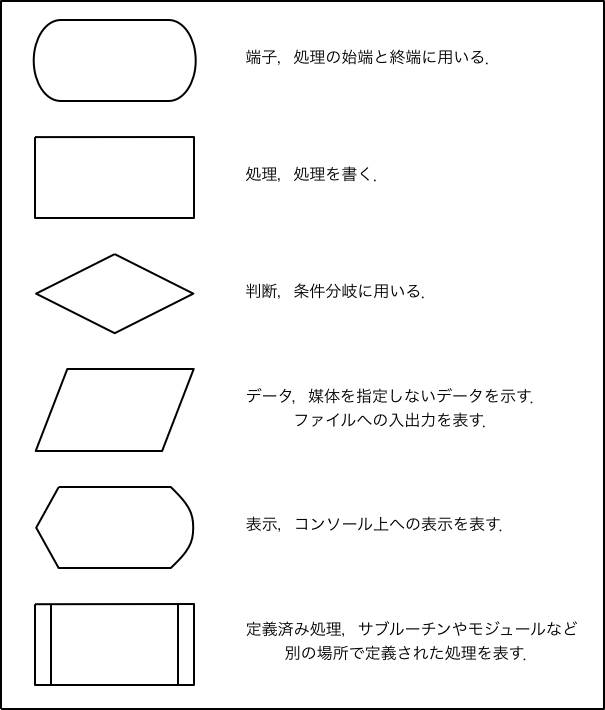
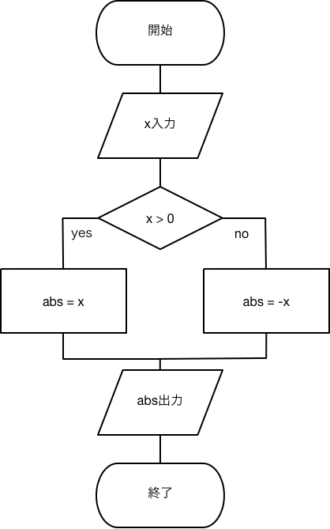

## 第2回 フローチャートと条件分岐
### 目的

フローチャートがかけるようになることと，制御文の一つであるif文を使いこなせるようになることを目的とする．

### フローチャートとは

フローチャートとは物事の処理の流れ，特にアルゴリズム(ある特定の問題を解く手順，コンピューターで計算を行うときの「計算方法」)を図で表す際に用いられる手法である．世界中で用いられており，日本ではJIS規格により仕様が定められている．フローチャートは主にプログラミングの処理のやり方を記すために使用されるが，その他に作業の手順などプログラミングとは関係ない場面でも用いられる．そのため，将来プログラミングの仕事をしない場合でも必要となる場面があるのでマスターしたほうがよい．

フローチャートは処理の方向を矢印，処理の内容を長方形などの図形を用い処理を表現する．フローチャートで用いられるの最低限の要素（図形）とその意味を図に示す．



### 例：絶対値を計算する処理のフローチャート

ここでは，絶対値を計算するためのフローチャートの作成を例に，フローチャートの書き方を学ぶ．絶対値とは，数の大きさであり０からどれだけ離れているかを表している．xの絶対値は，xが正の時xで，xが負の時-xである．では，入力した値の絶対値を表示するための手順を次の箇条書きに示す．

1. 変数ｘに値を入れる．
2. xが正の場合は変数absにxの値を入れる．xが負の場合はabsに-xの値を入れる．
3. absを表示する．

このように，絶対値を計算するためには主に3つの手順が必要なことが分かる．次に，この手順をフローチャートに書き直したものを見てみよう．



この例を見ると，xへ入力，absを出力といった入出力処理は平行四辺形で書かれていることが分かる．また，xの正負判断の処理（条件分岐）はひし形が用いられれいる．absにxを代入するといった処理は長方形で書かれている．少なくとも，長方形に処理，ひし形に条件分岐を書くということだけは覚えておこう．この２つさえ覚えていれば最低限のフローチャートを書くことができる．

__発展__ フローチャートはいらないという意見や有害という意見がある．確かに，細かく書きすぎてしまうとコーディングしているのと変わらない，表現力の限界がある，思考の邪魔など問題はある．しかし，フローチャートは使い方さえ間違えなければ有効な手段である．そして，プログラミングができてフローチャートが書けない，読めないという人はまずいない．

__課題2.1__

1. 成績scoreに成績点を入力し，scoreが60以上の場合は合格，60の場合は未満は不合格を表示する，という処理をフローチャートで表現せよ．
2. 前問で作ったフローチャートに，入力された値が0より小さい，および100より大きい場合は再入力をさせる機能を追加せよ．

### if文、else文

ここから，プログラミングでよく用いる制御文を学んでいく．制御文とは条件分岐，繰り返し処理のことである．プログラムは制御文の塊である．制御文をマスターすることがプログラミングをマスターすることと言っても過言ではない．この実験を通し制御文をマスターしよう．

まず今回は，条件分岐を学ぶ．C言語において主に用いられる条件分岐はif文，else文,
 else if文である．まず，if文の使い方を次に示す．

```c
if(条件式){
	処理;
}
```

if文は，まず括弧内の条件式を評価し，その条件式が真であればif文内の処理を実行する．条件式の書き方の例を次に示す．例えばaとbが一緒であるという条件を判定したい場合はa == bと書く．==を使うとaとbが同じ場合，真となり，同じでない場合は偽となる．また、aがb以上であるという条件を判定したい場合はa>=bと書く。条件式で用いることができる比較演算子を表に示す．

|比較演算子| 真になる場合 |
|:---:|:-----:|
| x == y | xとyが等しい場合 |
| x != y | xとyが異なる場合 |
| x > y | xがyより大きい場合 |
| x < y | xがyより小さい場合 |
| x >= y | xがy以上の場合 |
| x <= y | xがy以下の場合 |

初心者は条件判定で用いる記号(演算子)をよく間違えるので、皆も注意してほしい。最も単純でよく起こすミスに、==と書くべきところを=一つしか書かないミスがある。このミスはコンパイルが通ってしまうため発見が難しい。他には、>=と書くべきところを=>と書いてしまうミスがある。これはコンパイルで弾かれるため間違いがある事には気付きやすいが、数式としてはあっているように見えるため間違った場所を探すのに苦労しやすい。

if文を使ったプログラムの例として，絶対値の計算をするプログラムコードをリスト2.1に示す．このリストは，絶対値を計算する処理のフローチャートをC言語に直したものである．条件分岐の部分にif文を用いている．


```c
 1	/*リスト2.1*/
 2	#include <stdio.h>
 3
 4	int main(void)
 5	{
 6
 7	    double x = -1;
 8	    double abs;
 9
10	    if(x >= 0){
11	        abs = x;
12	    }
13	    if(x < 0){
14	        abs = -x;
15	    }
16
17	    printf("%fの絶対値は%fである．\n", x, abs);
18
19	    return(0);
20	}
```


__注__ double abs;はdouble abs = x;としたほうがif文を一つ減らせるので良いが，ここではif文の使い方を学ぶためにif文を多く使っている．

__注__ if文では，大括弧{}を省略する書き方があるが，バグのもとになるので，必ず大括弧を使うこと！！

__発展__ ANCI Cでは0は偽と扱われ，それ以外は真と扱われる．他の言語では真偽を取り扱うboolianと呼ばれる型が存在する場合がある．真偽は値としてどのように扱われるかを理解しておかないと，正しく動作しないプログラムになる場合がある．新たな言語を使う場合は必ずチェックしよう．

__課題2.2__ 点数を入力し，その点が60点以上の場合合格と表示されるプログラムを作成し，ソースコードを印刷して提出せよ．．

### 条件が複数ある場合1；入れ子（ネスト）構造

絶対値の処理では，1度に判定しなければならない条件は1つしか無かった．しかし，実践的なプログラムでは複数の条件を必要とする場合が多々ある．複数の条件を処理を実装する方法の一つとしてネストがある．ネストとは，if文の中にif文を入れる入れ子構造にすることである．ネスト構造の例を次に示す．

```c
if (条件式1){
    処理1;
    if (条件式2){     // ここの「if」は一番上の「if」の入れ子
        処理2;
        if (条件式3){   // ここの「if」は一つ上の「if」と一番上の「if」の入れ子
            処理3;
        }
    }
}
```

この例では，条件式1が真であった場合処理1が実行され，条件式1と条件式2が真であった場合処理2が実行される．条件式1，2，3すべて真であった場合処理3が実行される．

次に，変数xの値が60以上100以下かどうか判定する場合を考える．その場合は，xが60以上の条件と100以下の条件の2つを同時に満たす必要がある．これをネストを用い実現すると次のようになる．

```c
if(x >= 60){
    if(x <= 100){
        処理
    }
}
```

### 条件が複数ある場合2：論理演算

前節では条件が複数ある処理をネストを用い実現した．ネストは便利ではあるが，条件分岐が分かりづらい場合や，ソースコードが見づらくなりバグを生み出す原因になる場合がある．これまでの説明ではif文に用いた条件は1つだけであったが，実際には複数の比較演算を論理演算子でつなぐことで複数の条件を処理することができる．ここで，60以上100以下の値を判定するif文の例を示す．

```c
if(x >= 60 && x <= 100){
    処理
}
```

この例では60以上100以下を，xが60以上という条件とxが100以下という条件の論理積で表している．言い方を変えるとxが60以上かつxが100以下（xが60以上とxが100以下を同時に満たす）という計算をしている．"かつ"や"または"といった計算を論理演算と言い，論理演算で用いる演算子を論理演算子と言う．C言語で用いることができる論理演算子を表に示す．

|論理演算子| 真になる場合 |
|:---:|:-----:|
| && | and（かつ） |
| \|\| | or（または）  |
| ! | not（ではない） |

__課題2.3__ xが100より大きい，または0より小さいという条件を，比較演算子と論理演算子を用い実現せよ．

### else文

絶対値を計算するリスト2.1では，if文を2つ用いた．この2つのif文の条件はx >= 0とx < 0であったが，その条件は x >= 0 とそれ以外と言い換えることができる．C言語では，"それ以外"という処理を行うことができる．そのために用いられるのがelse文である．次に，else文の使い方を示す．

```c
if(条件式){
	処理1;
}else{
	処理2;
}
```

まず，if文の条件式が評価され，それが真であれば処理1が実行され，偽ならば処理2が実行される．つまり，else文の大括弧で挟まれた処理2はifで評価した条件以外のとき実行される．リスト2.2にelse文を用いた絶対値を計算するプログラムを示す．

```c
 1	/*リスト2.2*/
 2	#include <stdio.h>
 3
 4	int main(void)
 5	{
 6
 7	    double x = -1;
 8	    double abs;
 9
10	    if(x >= 0){
11	        abs = x;
12	    }else{
13	        abs = -x;
14	    }
15
16	    printf("%fの絶対値は%fである．\n", x, abs);
17
18	    return(0);
19	}
```

__課題2.4__

成績を入力し60以上は単位取得，60未満は不可を表示するプログラムを作成し，プログラムソースを提出せよ．ただし，else文を必ず用いること．

### else if文

else文を用いることで，if文で評価した条件以外のとき処理をするといったことができることを学んだ．では，if文で評価した条件以外かつ新しい条件評価するという処理を実現したい場合はどうすればよいだろうか．これまで学んだことを組み合わせて出来ないことはないが，C言語には"if文で評価した条件以外かつ新しい条件評価する"ということを実現できるelse if文と言うものが存在する．次に，点数を入力し80点以上は優，79点から60点以上は可，それ以外は不可を表示するプログラムリストを示す．

```c
 1	/*リスト2.3*/
 2	#include <stdio.h>
 3
 4	int main(void)
 5	{
 6	    int score = 70;
 7
 8	    if(score >= 80){
 9	        printf("優です．\n");
10	    }else if(score >= 60){
11	        printf("可です．\n");
12	    }else{
13	        printf("不可です．\n");
14	    }
15
16	    return(0);
17	}
```

このリストでは，まずscoreが80以上かどうかが評価される．scoreが80未満ならば次のelse if文に記されている条件が評価される．もしscore = 70ならばelse if文内に書かれた処理が実行される．

__課題2.5__ 試験の点数を入力し、対応する成績を表示するプログラムのためのフローチャートを書き，それに基づきプログラムを作成せよ。作成したプログラムコードは印刷して提出すること．成績評価は次のとおりとする．

* 80 点以上："優"
* 70 点以上、80 点未満："良"
* 60 点以上、70 点未満："可"
* 60 点未満："不可"
* 0点より小さい，または100点より高い点が入力された場合は"エラー"