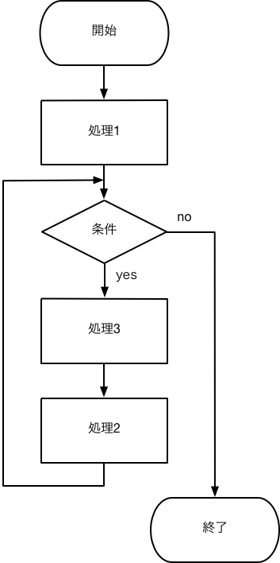

## 第3回 繰り返し処理

### 目的

繰り返し処理に用いられるfor文を使いこなせるようになることが目的である．

### 繰り返しfor

繰り返し処理はあらゆるプログラムのなかでif文とならび最も重要処理である。C言語において，繰り返し処理を実現するための命令はいくらか用意されているが、ここでは代表的なfor文を学ぶ。for文は次のように使用される。   

```c
for(処理1; 条件式; 処理2){
	処理3;
}
```

プログラム内でfor文が実行されると、まず処理1が実行される。次に条件式が評価され偽ならばfor文が終了する．条件が真の場合，その次に処理3が実行され，処理2が実行される．そして，条件が評価されfor文の終了判定を行う．これを繰り返す．for文の処理をフローチャートで表したものを図に示す。



__注__ for文を表すフローチャートは存在するが，ここでは処理の順番を理解してもらうために条件分岐を用いfor文の処理を実現している．

__注__ for文でも，大括弧{}を省略する書き方があるが，バグのもとになるので，必ず大括弧を使うこと！！

__注__ ループ処理にはwhile文もよく用いられるが，本実験ではfor文をマスターすることを重視しwhile文は取り扱わない．

#### 整数の総和

ループ処理の例として，1からNまでの整数の和を計算するプログラムを次に示す．このプログラムでは，総和の結果を入れる変数をsumとしている．sumを0で初期化し，for文を用いsumに1からNを足している．このプログラムではN回ループを回す必要があるため，条件はi<N+1もしくはi<=Nとしなければならない．しばしば，初学者はi<NとしてしまいiがN-1の値までしかとれない間違いをしてしまうので注意しよう．

```c
 1	/*リスト3.1*/
 2	#include <stdio.h>
 3
 4	int main(void)
 5	{
 6	    int N = 10;
 7	    int sum = 0;
 8	    int i;
 9
10	    for(i = 1; i < N + 1; i = i + 1){
11	        sum = sum + i;
12	    }
13
14	    printf("%d\n", sum);
15
16	    return(0);
17	}
```

__課題3.1__ 1からNまでの整数の和を表示させるためのフローチャートをかけ．

__課題3.2__ リスト3.1を変更し，1以上の整数Nの階乗を計算するプログラムにし，変更箇所を報告せよ．整数Nの階乗とは1\*2*...*(n-1)*nのことである。

### インクリメントとデクリメント

リスト3.1のfor文のではi=i+1という計算がされている．このように変数に1を足す処理はプログラミング，特にfor文では多用される．プログラミングの世界では，このような変数に1を足す処理処理および1を引く処理をそれぞれインクリメント，デクリメントと呼ぶ．そして，インクリメントおよびデクリメントを行う演算子として，インクリメント演算子(++)とデクリメント演算子(--)が用意されている．では，

```c
i=i+1;
```

という処理を，インクリメント演算子で書き直すと

```c
i++;
```

となる．

### 代入演算子

インクリメント演算子とデクリメント演習を用いれば，変数に1を足すもしくは1を引くという処理を簡単に書くことができる．では，プログラム内で2を足すもしくは2をかけると言った処理を簡単に書きたい場合はどうすればよいか．C言語では，代入演算子を使うことで2を足すといった簡単な四則演算を単純な書式でかける．例えば，変数iに2を足す処理は

```c
i = i + 2;
```

と書けるが，代入演算子を使うと

```c
i += 2;
```

といったように，簡単に書くことができる．プログラムではある数の足し算を繰り返すような処理が多く書かれる．そのような場合は，代入演算子を使ってみても良いかもしれない．

|代入演算子の使用例|  等価な処理  |
|:---:|:-----:|
|  a += b  |  a = a + b |
|  a -= b  |  a = a - b |
|  a *= b  |  a = a * b |
|  a /= b  |  a = a / b |
|  a %= b  |  a = a % b |

__課題3.3__ リスト3.1をインクリメント演算子や代入演算子を用い書き直し，書き直した箇所を報告せよ．

### 多重ループ

多重ループとは，次のようにロープ処理が入れ子構造になっているものである．

```c
for(処理1; 条件式1; 処理2){
    for(処理3; 条件式2; 処理4){
        処理5;
    }
}
```

このような2個ループがある多重ループを2重ループと呼ぶ．この処理は言葉で説明するには複雑なので，次のフローチャートを見て多重ループの処理の流れを理解しよう．


次に２重ループの例としてMxN個の*(アスタリスク)を

```
****
****
****
```

このように表示させるプログラムをリスト3.2に示す．このソースコードでは，２つ目のfor文で横にN個のアスタリスクを書き，そのfor文を最初のfor文でM回呼び出すことでM行描いている．

```c
 1	/*リスト3.2*/
 2	#include <stdio.h>
 3
 4	int main(void)
 5	{
 6	    int M = 3, N = 4;
 7	    int i, j;
 8
 9	    for(i = 0; i < M; i++){
10	        for(j = 0; j < N; j++){
11	            printf("*");
12	        }
13	        printf("\n");
14	    }
15
16	    return(0);
17	}
```

__課題3.4__ 九九表を表示するプログラムを作成し，印刷して提出せよ．ただし、for文を使うこと。

__課題3.5__ *(アスタリスク)を次のように下向きの三角形状に配置するプログラムを作成し，印刷して提出せよ．ただし，多重ループを必ず使うこと．

```
*
**
***
****
*****
```

__課題3.5__ *(アスタリスク)を次のように下向きの三角形状に配置するプログラムを作成し，印刷して提出せよ．ただし，多重ループを必ず使うこと．

```
*****
 ****
  ***
   **
    *
```

### for文とif文の組み合わせ

次に，応用としてfor文だけではなくif文も使ったプログラムに挑戦する．for文とif文両方を使ったプログラムの例として，Nまでの整数の中で偶数のみを出力するリスト3.3を示す．

```c
 1	/*リスト3.2*/
 2	#include <stdio.h>
 3
 4	int main(void)
 5	{
 6	    int N = 10;
 7	    int i;
 8
 9	    for(i = 0; i < N + 1; i++){
10	        if(i % 2 == 0){
11	            printf("%dは偶数です\n", i);
12	        }
13	    }
14
15	    return(0);
16	}
```

__課題3.6__ １からNまでの整数を表示するが、３で割り切れる倍は"Fizz"、５で割り切れる場合は"Buzz"、３と５で割り切れる場合は"FizzBuzz"を数字の代わりに表示するためのフローチャートをかけ．（この問題はFizzBuzz問題と呼ばれる）

__課題3.7__ 前問で作成したフローチャートに基づきプログラムを作成せよ．


__課題3.8(発展)__ インクリメント演算子には，++iと書く前置インクリメントとi++と書く後置インクリメントがある．iに1を足すだけに用いる場合には，どちらも同じ結果を得ることができる．しかし，j=i++とj=++iのような場合は，同じ結果が得られない．j=i++とj=++iが等価でないことを実際にプログラムを書いて確かめ，それぞれどのような処理が行われたか報告せよ．
